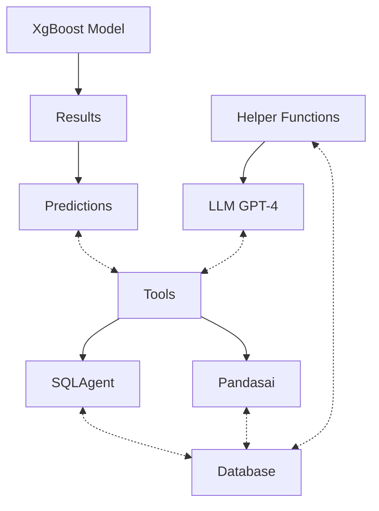

# TKO Analytics

An advanced UFC analytics platform powered by AI that provides deep insights into fight statistics, predictions, and performance metrics.

## Demo

Click the image above to watch the demo video!

## Features

### Core Features
- Natural language interaction with UFC fight data
- Real-time statistical analysis and visualization
- Machine learning-powered fight predictions
- Multi-dimensional data exploration
- Automated insight generation
- Interactive data visualization

### Data Analysis
- Comprehensive UFC fight database updated through November 2024
- Multi-table query support for complex statistical analysis
- Real-time data visualization using PandasAI
- Advanced fight outcome predictions using XGBoost ML models
- Historical fight statistics and performance metrics
- Betting odds analysis and probability calculations

### Interactive Interface
- Natural language query processing using GPT-4
- Conversational AI assistant for data exploration
- Dynamic visualization generation
- Interactive dashboard with configurable views
- Multi-table data exploration capabilities
- Context-aware follow-up questions
- Custom table selection interface
- Real-time query modification
- Flexible window configuration
- Historical conversation tracking
- Integrated visualization panels

### Analysis Capabilities
- Fight outcome predictions with confidence scores
- Fighter performance trend analysis
- Betting odds analysis and probability calculations
- Head-to-head fighter comparisons
- Fighting style analysis
- Win/loss pattern recognition
- Title fight statistics
- Performance metrics tracking
- Historical matchup analysis
- Round-by-round statistics

### Technical Capabilities
- SQL query optimization for complex multi-table analysis
- BCNF-normalized database structure
- Real-time data processing and visualization
- Machine learning integration for predictive analytics
- Scalable architecture supporting live data updates
- Helper functions for optimized LLM context management
- Hybrid visualization approach for both single and multi-table analysis
- Token-optimized database schema handling

## Application Design

### Architecture Overview

### Key Components

#### 1. Core Analysis Engine
- **SQL Query Tool**: Handles complex multi-table queries using LangChain's SQL agent
- **Visualization Engine**: PandasAI integration for dynamic chart generation
- **Prediction System**: XGBoost-based model for fight outcome predictions
- **Data Pipeline**: Optimized for real-time updates and analysis

#### 2. LLM Integration
- Natural language query parsing
- Context-aware conversation management
- Automated query optimization
- Dynamic response generation

#### 3. Optimization Features
- Smart caching for frequent queries
- Token-optimized database schema handling
- Efficient multi-table join operations
- Memory-optimized result storage

#### 4. User Interface Components
- Interactive chat interface
- Dynamic visualization panel
- Table selection sidebar
- Configurable analysis windows
- Conversation history tracking

## Database Schema

### Core Tables
- **Fighters**: FighterID (PK), Name
- **Fights**: FightID (PK), Date, Location, Winner, FinishDetails, FinishRound, FinishRoundTime, TotalFightTimeSecs, RedFighterID (FK), BlueFighterID (FK)
- **Odds**: OddsID (PK), FightID (FK), RedOdds, BlueOdds, RedExpectedValue, BlueExpectedValue, RedDecOdds, BlueDecOdds, RSubOdds, BSubOdds, RKOOdds, BKOOdds

## Technology Stack
- **Backend**: Python, SQLite
- **ML/AI**: XGBoost, GPT-4, LangChain
- **Data Analysis**: PandasAI
- **Visualization**: Custom plotting tools with multi-table support

## Future Development
- Real-time fight analytics pipeline
- Enhanced prediction models incorporating fighting styles
- Live prediction capabilities
- Interactive visualization improvements
- React-based frontend migration
- Personalized user dashboards

## Installation
Repository available at: https://github.com/jaysomp/tko-analytics

## Authors
- Jaydeep Sompalli
- Jeet Arora
